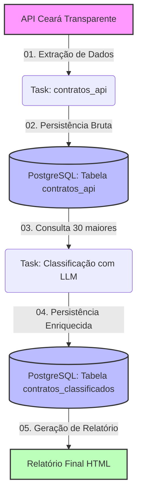

# Relatorio_Ceara_Transparente

# Sobre o Projeto

O projeto consiste na automação de um pipeline de dados orquestrados pelo Apache Airflow que consome e analisa os contratos públicos da API do Ceará Transparente. O objetivo principal é extrair os registros de contratos nas ultimas duas semanas, armazená-los no PostegreSQL, e utilizar um modelo de Large Language Model (LLM) para classificar semanticamente os 30 registros com os maiores valores financeiros. A solução poderá contribuir
para agilizar a análise das áreas que recebem os maiores investimentos públicos, gerando um relatório automatizado em HTML

# 1) Arquitetura do Pipeline

# 2) Pré-Requisitos

    Antes de Inciar certifique-se de ter instalado na sua máquina:
    - [Docker Desktop] (https://www.docker.com/products/docker-desktop/) (rodará o Airflow e o PostgreSQL internamente)
    - Um cliente de banco de dados (ex: [DBeaver] (https://dbeaver.io/download/) ou [PGAdmin] (https://www.pgadmin.org/download/))
    - Uma API de serviço de LLM configurada (ex: OpenAI, Groq, Gemini, etc.)

# 3) Ferramentas Utilizadas
O projeto foi desenvolvido utilizando as seguintes ferramentas/frameworks:

* **Linguagem de Programação**: Python 3.12
* **Orquestração do Fluxo**: Apache Airflow (para agendamento e execução das tasks)
* **Banco de Dados Relacional**: PostgreSQL (para armazenamento de dados brutos e classificados)
* **Inteligência Artificial**: Groq (para classificação dos contratos de maior valor financeiro)
* **Infraestrutura**: Docker & Docker Compose (para containerização de todo o ambiente)
* **Visualização**: Relatórios gerados dinamicamente através de HTML

# 4) Preparação no Docker

Caso seu container ainda não esteja criado no Docker Desktop,
execute os seguintes comandos dentro do terminal do VS CODE

1) **Criação dos Containers**

    **docker compose up --build -d**
    - Realiza a criação de um Docker Compose contendo os serviços
      a serem utilizados na execução do projeto, além de excutar o 
      documento que instala as dependênciais esperada para a dag rodar

2) **Verificar se os containers estão funcionando**
  
    **docker compose ps**
    - Avaliar os status de cada container no Docker Compose

    **docker compose logs -f**
    - Analisa os logs em tempo real

3) **Verificar se está funcionando**

    Acesse o site http://localhost:8080 para entrar na interface do Airflow Webserver. Caso a DAG demore para aparecer na listagem, você pode forçar a reinicialização rápida do Scheduler e do Webserver com o comando:

    - **docker compose restart**

    Caso queira reinicializar por completo, limpando o ambiente, execute esses comandos:

    - **docker compose down** (remoção dos containers)
    - **docker compose up -d** (inserção dos mesmos containers)

    Esses comandos reiniciam os containers, forçando o scheduler do Airflow a ler
    a pasta de Dags novamente e atualizar a interface

4) **Comandos para manutenção**
   
    **docker compose stop**
    - Encerra as atividades do docker compose sem remover os dados

    **docker compose down**
    - Para e remove todos os containers e redes criados pelo projeto

    **docker compose start**
    * Inicia os containers que estavam pausados
